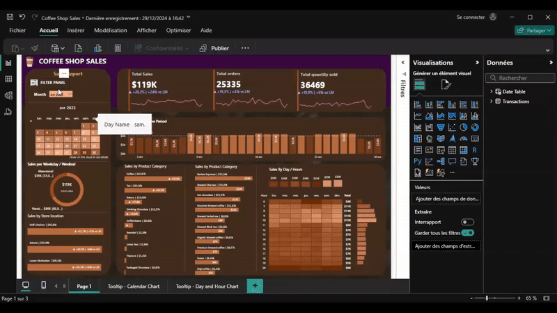

# Coffee Shop Sales Dashboard - Power BI

## Overview

This project is a comprehensive sales dashboard for a coffee shop, built using Power BI. It's designed to provide actionable insights into sales trends, customer behavior, and product performance, ultimately empowering data-driven decisions to optimize operations and boost profitability.  The dashboard is intended for use by store managers, owners, and marketing teams.

Here is a google drive link to access the dashboard itself, and the data : [drive/folder...](https://drive.google.com/drive/folders/1nTyEOqkOe5N3FmEjhlSLkFSyxS9ELOn2?usp=sharing). .
The dashboard offers a high-level overview of key performance indicators (KPIs) and allows users to drill down into specific areas of interest through interactive visualizations. It aims to answer questions like:

*   What are our best-selling products?
*   Which locations are performing best?
*   How are our marketing campaigns impacting sales?
*   Are we retaining our customers?
*   What are the peak hours for sales, and how can we optimize staffing?

## Key Features

*   **Executive Summary:**
    *   Overall sales revenue, profit margin, and customer count.
    *   Month-over-month and year-over-year growth trends.
    *   Key performance indicators (KPIs) with visual alerts for areas needing attention.
*   **Sales Performance Analysis:**
    *   Detailed sales breakdown by product category (e.g., coffee, pastries, merchandise).
    *   Sales by individual product, highlighting top performers and underperforming items.
    *   Geographic sales analysis, if applicable (sales by store location or region).
    *   Sales trends over time, with options to filter by day, week, month, or year.
*   **Customer Behavior Insights:**
    *   Customer demographics (e.g., age, gender) if available.
    *   Customer segmentation based on purchase frequency and spending habits.
    *   Analysis of customer loyalty program participation and effectiveness.
    *   Identification of key customer segments and their preferences.
*   **Product Performance Deep Dive:**
    *   Detailed product margin analysis, identifying the most profitable items.
    *   Impact of promotions and discounts on product sales.
    *   Inventory analysis to identify potential stockouts or overstocked items.
    *   Product mix analysis, showing the relative contribution of each product to overall sales.
*   **Interactive Filtering and Drill-Down:**
    *   Interactive filters allowing users to slice and dice the data by date range, product category, location, and customer segment.
    *   Drill-down capabilities to explore specific data points in greater detail.
    *   Customizable views to focus on the metrics that are most important to each user.

## Contributing

We welcome contributions to improve this dashboard! If you have ideas for new features, visualizations, or data sources, please submit a pull request.

1.  Fork the repository.
2.  Create a new branch for your feature or bug fix.
3.  Make your changes and commit them with descriptive messages.
4.  Submit a pull request to the main branch.
